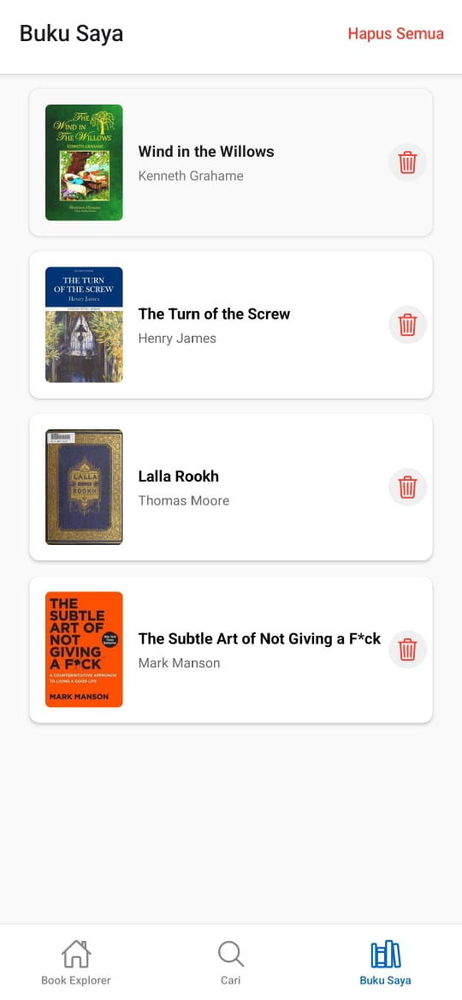

# Aplikasi Book Explorer

Aplikasi mobile yang dibuat dengan React Native (Expo) yang memungkinkan pengguna untuk mencari, melihat, dan menyimpan buku dari Open Library API.

## Fitur

- Jelajahi buku-buku yang sedang tren di layar beranda
- Cari buku berdasarkan judul, penulis, atau kata kunci
- Lihat informasi detail dari setiap buku
- Simpan buku favorit ke koleksi pribadi
- Bagikan buku kepada orang lain

## Teknologi yang Digunakan

- React Native dengan Expo
- Expo Router untuk navigasi
- Open Library API untuk data buku
- AsyncStorage untuk penyimpanan data lokal
- Expo Vector Icons untuk elemen UI

## DESIGN UI&UX

### Layar Beranda


### Layar Detail Buku


### Layar Buku Saya


### Layar Buku Saya


### Komponen Desain
Aplikasi menggunakan skema warna dan tipografi yang konsisten di seluruh tampilan:
- Warna Utama: #0066cc
- Warna Sekunder: #f5f5f5
- Warna Teks: #333 (utama), #666 (sekunder), #888 (tersier)
- Ukuran Font: 22px (judul), 16px (isi), 14px (caption)

## Instalasi & Setup

1. Kloning repositori:
```bash
git clone https://github.com/yourusername/book-explorer-app.git
cd book-explorer-app
```

2. Instal semua dependensi:
```bash
npm install
```

3. Jalankan server pengembangan:
```bash
npx expo start
```

4. Jalankan di perangkat atau emulator:
   - Pindai kode QR dengan aplikasi Expo Go di ponsel
   - Tekan `a` untuk emulator Android
   - Tekan `i` untuk simulator iOS

## Struktur Proyek

```
book-explorer-app/
├── app/                    # Layar utama aplikasi (expo-router)
│   ├── _layout.js          # Komponen layout utama
│   ├── index.js            # Layar beranda
│   ├── details/[id].js     # Layar detail buku
│   └── my-books.js         # Layar buku yang disimpan
├── components/             # Komponen UI yang dapat digunakan kembali
│   ├── BookCard.js         # Komponen kartu buku
│   ├── BookList.js         # Komponen daftar buku
│   └── SearchBar.js        # Komponen input pencarian
├── services/               # Fungsi API dan layanan
│   └── api.js              # Integrasi dengan Open Library API
├── utils/                  # Fungsi utilitas
│   └── storage.js          # Helper untuk AsyncStorage
├── assets/                 # Gambar, font, dan file statis lainnya
│   └── UI&UX/        # Design UI&UX
└── app.json                # Konfigurasi Expo
```

## Proses Pengembangan

Aplikasi ini dikembangkan melalui tahapan berikut:

1. Setup awal proyek dengan Expo dan expo-router  
2. Implementasi layanan API Open Library  
3. Pembuatan komponen UI yang reusable  
4. Pengembangan layar-layar utama  
5. Penambahan fungsi penyimpanan lokal  
6. Penyempurnaan tampilan dan pengujian

## Pengembangan di Masa Depan

- Tambah autentikasi pengguna  
- Tambah kategori buku dan fitur filter  
- Lacak progres membaca  
- Integrasi dengan API buku lainnya  
- Tambah dukungan mode gelap

## Kredit

- [Open Library API](https://openlibrary.org/developers/api)  
- [Expo](https://expo.io/)  
- [React Native](https://reactnative.dev/)  
- Ikon oleh [Ionicons](https://ionicons.com/)

## Lisensi

Lisensi MIT